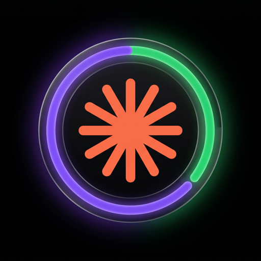
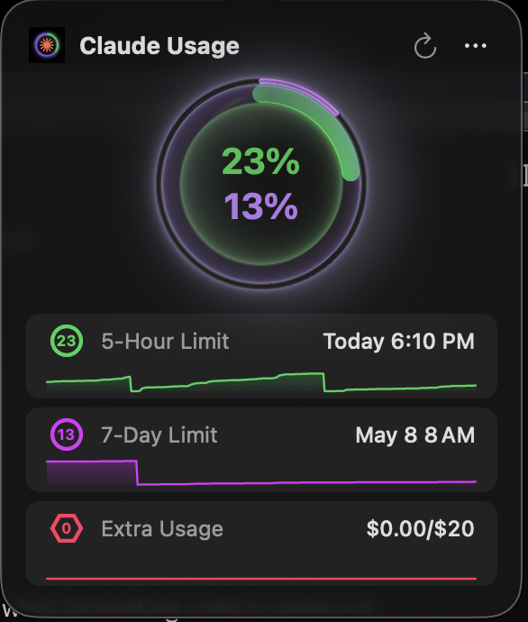
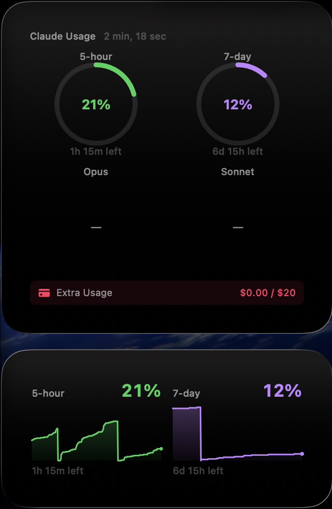

# U4Claude (Arcanii Mod)

A personal fork of [**f-is-h/Usage4Claude**](https://github.com/f-is-h/Usage4Claude) — the original menu-bar Claude usage monitor. **All credit for the underlying app goes to [@f-is-h](https://github.com/f-is-h)** — this fork only layers a few macOS 26 / Tahoe niceties on top.

> Forked from upstream **v2.6.0** (April 2026). Thank you f-is-h! 🙇

<div align="center">



[](https://www.apple.com/macos/)
[](https://swift.org)
[](https://developer.apple.com/xcode/swiftui/)
[](https://sparkle-project.org)
[](LICENSE)
[](https://github.com/arcanii/Usage4Claude-Arcanii/releases)

**A macOS menu-bar app for real-time monitoring of your Claude AI usage — with Liquid Glass rings, a desktop widget, and one-click in-app updates.**





[What's different](#-whats-different-in-this-fork) • [Install](#-install) • [Features](#-features) • [User guide](#-user-guide) • [FAQ](#-faq)

</div>

---

## 🌀 What's different in this fork

This fork tracks the upstream feature set faithfully (all the features listed below come from f-is-h). It adds a small set of macOS 26 / Tahoe-specific changes:

| Change | Since |
|---|---|
| **Bundled as `U4Claude.app`** with bundle id `com.arcanii.Usage4Claude` so it can coexist with the upstream `Usage4Claude.app` | v1.0.0 |
| **macOS 26 / Tahoe minimum** (was 13.0) — uses Apple's Liquid Glass material unconditionally | v1.4.0 |
| **One-click in-app updates** via [Sparkle](https://sparkle-project.org) (EdDSA-signed) — replaces the old "download → drag-to-Applications" flow | v1.3.0 |
| **Desktop widget** (small + medium) reading from an App Group snapshot — no extra API calls | v1.4.0 |
| **Glass-tube popover rings** with a configurable illumination slider in General Settings → "Popover Appearance" | v1.3.1 / v1.4.1 |
| **Auto-relogin throttle** that recovers from a dismissed WebLogin window | v1.4.1 |
| **Spoofed Chrome user-agent** kept current (148 as of 2026-05) | v1.4.1 |
| **API response models extracted** with 35-test SwiftPM coverage; `fetchOrganizations` migrated to `async/await` | v1.5.0 |

The fork is maintained by [@arcanii](https://github.com/arcanii) as a personal mod. Issues and PRs welcome here, but for **general** Usage4Claude contributions, please go upstream to [f-is-h/Usage4Claude](https://github.com/f-is-h/Usage4Claude) — that's the canonical project.

---

## ✨ Features

(Inherited from upstream unless marked "fork".)

### Core monitoring
- **Real-time** Claude subscription (Free/Pro/Team/Max) usage in the menu bar
- **5 limit types** simultaneously: 5-hour, 7-day, Extra Usage, 7-day Opus, 7-day Sonnet
- **Smart display** auto-detects available limit types; **custom display** lets you pick any combination
- **Smart colors** — green → orange → red on the 5-hour ring; cyan → purple on 7-day; per-color schemes for Opus / Sonnet / Extra
- **Cross-platform** — same quota whether you're using claude.ai web, Claude Code, the desktop app, mobile, or Cowork

### UI & display
- **Multiple display modes**: Percentage Only, Icon Only, Icon + Percentage, Unified concentric rings
- **Three icon styles**: Color Translucent, Color with Background, Monochrome (template — adapts to system menu bar)
- **Glass-tube popover rings** with user-tunable illumination *(fork)*
- **Desktop widget** (small + medium) *(fork)*
- **Time format**: System / 12-hour / 24-hour
- **Appearance**: System / Light / Dark
- **Localization**: English, 日本語, 简体中文, 繁體中文, 한국어

### Refresh & notifications
- **Smart refresh** — adaptive 4-tier (active 1m → idle-short 3m → idle-medium 5m → idle-long 10m), or fixed (1 / 3 / 5 / 10 min)
- **Manual refresh** with 10-second debounce (`⌘R`)
- **Usage notifications** at 90% and on reset (toggleable)
- **In-app updates via Sparkle** *(fork)* — background daily check + manual "Check for Updates" with EdDSA verification

### Auth
- **Multi-account / multi-org** — `⌘1`–`⌘9` to switch
- **Built-in WebLogin** — opens claude.ai in an embedded `WKWebView`, scrapes `sessionKey` automatically (no DevTools fishing)
- **Auto-relogin prompt** when the session expires — including recovery from a dismissed login window *(fork)*
- **Keychain-stored credentials** — no plaintext on disk

### Convenience
- Launch at Login (`SMAppService`)
- Keyboard shortcuts: `⌘R` refresh, `⌘,` General Settings, `⌘⇧A` Auth Settings, `⌘Q` quit
- Welcome wizard on first launch
- Diagnostic export (redacted) for support
- Universal binary (Intel + Apple Silicon)

### Privacy
- All data stored locally; no telemetry, no analytics, no third-party services
- Network calls go only to `claude.ai` and (for updates) `raw.githubusercontent.com` (Sparkle appcast)
- Source 100% open under MIT

---

## 💾 Install

### Download (recommended)

1. Grab the latest `.dmg` from [**Releases**](https://github.com/arcanii/Usage4Claude-Arcanii/releases).
2. Mount it, drag `U4Claude.app` to `/Applications`.
3. First launch: right-click → **Open** to bypass Gatekeeper's quarantine prompt for an externally-distributed app.
4. Allow Keychain access for the session key on first save.

After v1.3.0+, future updates install via the in-app **Check for Updates** menu (or the automatic 24h background check) with no further drag-and-drop.

### Build from source

```bash
git clone https://github.com/arcanii/Usage4Claude-Arcanii.git
cd Usage4Claude-Arcanii

# Debug build (Xcode 26.0+ required)
DEVELOPER_DIR=/Applications/Xcode.app/Contents/Developer \
  xcodebuild -project Usage4Claude.xcodeproj -scheme Usage4Claude \
  -configuration Debug -allowProvisioningUpdates build

# Run tests (35 tests, SwiftPM target)
DEVELOPER_DIR=/Applications/Xcode.app/Contents/Developer swift test
```

For the full release pipeline (signed → notarized → stapled → Sparkle-signed DMG), see [`scripts/build.sh`](scripts/build.sh) and the [release runbook in HANDOVER.md](docs/HANDOVER.md#releasing).

**Requirements**: macOS 26.0 (Tahoe) or later, Xcode 26.0+, an Apple Developer account if you want to sign + notarize. Universal binary (x86_64 + arm64).

---

## 📖 User guide

### Initial setup

1. **Launch** — the welcome screen appears on first run.
2. **Authenticate** — two paths:
   - **Browser Login** (recommended): click the button, log into claude.ai in the embedded browser, the session key is extracted automatically.
   - **Manual paste**: open claude.ai → DevTools → Network → find a `usage` request → copy `sessionKey=sk-ant-…` from the Cookie header.

### Daily use

- Click the menu bar icon → popover with detail rows.
- Tap a row to toggle between *remaining time* and *reset time*.
- Long-press the ring (3 s) to cycle the loading-animation style.
- `⌘R` to refresh; `⌘,` for General Settings; `⌘⇧A` for Auth Settings; `⌘Q` to quit.
- Right-click the menu bar icon for the same menu the popover's `…` button shows.
- Multi-account: `⌘1`–`⌘9` to switch between configured accounts.

### Refresh modes

- **Smart** (default) — 1 min while you're active, drops to 3 / 5 / 10 min after consecutive unchanged ticks. Snaps back to 1 min on any utilization change, manual refresh, or popover open.
- **Fixed** — pick 1 / 3 / 5 / 10 min and stay there.

### Updating

- **Background**: Sparkle polls the appcast once every 24 h. When a newer signed build is available, you get a Sparkle prompt — Install / Skip / Remind Later.
- **Manual**: `…` menu → **Check for Updates**.
- **Verification**: every update is EdDSA-signed; Sparkle refuses tampered or corrupted DMGs.

---

## ❓ FAQ

<details>
<summary><b>What if the app shows "Session Expired"?</b></summary>

Session keys expire periodically (weeks to months). The app auto-prompts a re-login window on the first expiry; if you dismiss it, hitting the refresh button (or reopening the popover after 30 s) re-prompts. You can also re-login manually from Settings → Authentication.

</details>

<details>
<summary><b>How much does it cost in resources?</b></summary>

Lightweight: well under 0.1 % CPU at idle, ~20 MB resident memory, one HTTPS request per refresh tick. The widget extension reads from a shared file — it doesn't make its own network calls.

</details>

<details>
<summary><b>Why does this fork need macOS 26 / Tahoe?</b></summary>

The popover rings layer Apple's [Liquid Glass](https://developer.apple.com/design/human-interface-guidelines/) material via `.glassEffect(in:)`, which is macOS 26 only. If you're on macOS 13–15 and don't need that look, the upstream [f-is-h/Usage4Claude](https://github.com/f-is-h/Usage4Claude) keeps a 13.0+ deployment target and is the right choice for you.

</details>

<details>
<summary><b>Does it work with Claude Code / Desktop / Mobile / Cowork?</b></summary>

Yes — all Claude products share the same usage quota, so a single `sessionKey` covers them all. You'll see your combined usage in the menu bar regardless of which clients you're hitting the API from.

</details>

<details>
<summary><b>Is my data safe?</b></summary>

Yes. Session keys live in macOS Keychain (AES-256, hardware-protected on T2/Apple Silicon). The Organization ID lives in `UserDefaults` (it's not a credential, it's a UUID). Nothing leaves your Mac except the calls to `claude.ai/api/...` and (for updates) the raw GitHub host serving the Sparkle appcast. The widget extension is sandboxed with **no network** entitlement.

</details>

<details>
<summary><b>Can't see the menu bar icon?</b></summary>

Some macOS versions and third-party tools (Bartender, Hidden Bar) auto-hide infrequently used items. Hold **⌘** and drag icons to rearrange them; drop the U4Claude icon somewhere visible. On Sonoma+ also check System Settings → Control Center.

</details>

<details>
<summary><b>How do I add the desktop widget?</b></summary>

Run U4Claude at least once (so it writes the App Group snapshot), then right-click on your desktop → **Edit Widgets…** → search "Claude Usage" → drag the small or medium variant onto the desktop. The widget refreshes immediately on every successful main-app fetch.

</details>

---

## 🛠 Tech stack

- **Swift** 6.2, MainActor default isolation
- **SwiftUI** + AppKit hybrid (popover, menu bar item, settings windows)
- **Combine** for view-model bindings
- **App Group** (`group.com.arcanii.Usage4Claude`) shared by main app + widget
- **Sparkle** 2.9.1 (EdDSA-signed in-app updates)
- **WidgetKit** for the desktop widget
- **macOS 26.0+**, Universal binary (x86_64 + arm64)

For the architecture map, error mapping table, and release runbook, see [`docs/HANDOVER.md`](docs/HANDOVER.md) and [`docs/ARCANII_DESIGN.md`](docs/ARCANII_DESIGN.md).

---

## 🗺 Roadmap

### Closed in this fork
- [x] **v1.0.0** — initial fork with dual display + branding
- [x] **v1.1.0** — notarized DMG, session-expired error mapping fix
- [x] **v1.2.0** — auto-prompt re-login, ⌘1–⌘9 account switching, CSV history export, multi-account refinements
- [x] **v1.3.0** / **v1.3.2** — Sparkle in-app updates (EdDSA-signed)
- [x] **v1.3.1** — glass-tube glow on popover rings + macOS 26 Liquid Glass
- [x] **v1.4.0** — desktop widget extension + App Group snapshot
- [x] **v1.4.1** — ring illumination slider, auto-relogin throttle fix, Chrome UA bump
- [x] **v1.5.0** — API response models extracted, 24 new transform tests, `fetchOrganizations` async/await migration
- [x] **v1.5.1** — backported upstream v2.6.1 fixes: HTTP/3 disabled on API requests (proxy-friendliness), Extra Usage shown with cents precision
- [x] **v1.6.0** — usage history visible: 24h sparkline under every popover row, plus four new desktop widget kinds (Large Dashboard, Sparkline, Dual-Sparkline, ExtraLarge). Storage rebuilt on NDJSON in the App Group container.

See [`docs/RELEASES/`](docs/RELEASES/) for full per-version notes.

### Open
- [ ] Move usage history to NDJSON / SQLite (avoid full-file rewrite per tick)
- [ ] Sparkline overlay on popover rings (or "History" tab)
- [ ] Recurring Chrome UA bump (cron / scheduled agent)
- [ ] Widget bundle ID rename (deferred — breaks existing App Group profile)

See [`docs/ARCANII_BACKLOG.md`](docs/ARCANII_BACKLOG.md) for effort tags.

---

## 🤝 Contributing

This is a personal fork. Issues and PRs are welcome — file them at [arcanii/Usage4Claude-Arcanii](https://github.com/arcanii/Usage4Claude-Arcanii/issues).

For **general** Usage4Claude contributions (features that should land for everyone, not just Tahoe users), please contribute upstream to [**f-is-h/Usage4Claude**](https://github.com/f-is-h/Usage4Claude) — that's where the broader community lives.

See [`CONTRIBUTING.md`](CONTRIBUTING.md) for the upstream contribution guide (still applies here).

---

## 📝 Changelog

See [`CHANGELOG.md`](CHANGELOG.md) for upstream history. Fork-specific notes live in [`docs/RELEASES/`](docs/RELEASES/) — one file per fork release.

---

## 📄 License

MIT — see [`LICENSE`](LICENSE). Original copyright © 2025 [f-is-h](https://github.com/f-is-h); fork modifications © 2026 [arcanii](https://github.com/arcanii). Both retained under the same MIT terms.

---

## 🙏 Acknowledgments

- **[@f-is-h](https://github.com/f-is-h)** for building the original Usage4Claude — none of this exists without his work.
- **[Anthropic](https://anthropic.com)** for Claude.
- **[Sparkle](https://sparkle-project.org)** for the in-app update framework.
- The original icon was inspired by Claude AI's branding.

---

## ⚖️ Disclaimer

This is an independent third-party tool with no official affiliation with Anthropic or Claude AI. The app authenticates via the same private `claude.ai/api/organizations/<id>/usage` endpoint the website uses; if Anthropic changes that endpoint, the app will break until updated. Please comply with [Claude AI's Terms of Service](https://www.anthropic.com/legal/consumer-terms) when using this software.

---

<div align="center">

If this fork helps you, **star it** — and please also star [**upstream**](https://github.com/f-is-h/Usage4Claude) where the real work happens.

Forked with care by [@arcanii](https://github.com/arcanii) · [⬆ Back to top](#u4claude-arcanii-mod)

</div>
